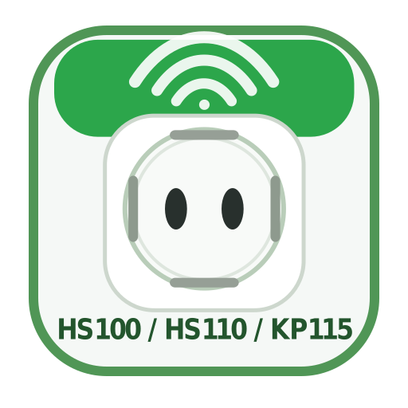

  

<h1 align="center">TP-Link Plug Control for LoxBerry</h1>

  <a href="docs/index.md">Dokumentation / Documentation</a> ·
  <a href="docs/de/README.md">Deutsch</a> ·
  <a href="docs/en/README.md">English</a>

---

**DE:** LoxBerry Plugin zur lokalen Steuerung von TP-Link/Kasa Smart Plugs wie **HS100**, **HS110** und **KP115** – inklusive Loxone XML-Export für Virtual Inputs/Outputs.

**EN:** LoxBerry plugin for local control of TP-Link/Kasa smart plugs such as **HS100**, **HS110** and **KP115**, including Loxone XML export for Virtual Inputs/Outputs.

## Dokumentation / Documentation

👉 [Zur Dokumentation / Open documentation](docs/index.md)

## Kurzüberblick / Quick overview

- Lokale Steuerung ohne TP-Link Cloud / Local control without TP-Link Cloud
- Autodiscovery im LAN / LAN autodiscovery
- Schalten, Status, LED, Uhrzeit / Relay, status, LED, time
- Loxone VirtualOut und VirtualIn XML / Loxone VirtualOut and VirtualIn XML
- Deutsch und Englisch / German and English

---

  <a href="https://github.com/5iggi/tplink-plug-control">GitHub Repository</a> ·
  <a href="docs/index.md">Documentation</a> ·
  <a href="https://github.com/5iggi">5iggi</a>

