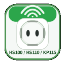

<p align="center">
  
</p>

<h1 align="center">Installation</h1>

<p align="center">
  <a href="../index.md">Documentation index</a> ·
  <a href="README.md">English</a> ·
  <a href="../de/README.md">Deutsch</a> ·
  <a href="../../README.md">Repository README</a>
</p>

---

## Requirements

- LoxBerry with plugin management
- TP-Link/Kasa smart plug in the local network
- Static IP address or DHCP reservation recommended
- Optional: Loxone Config for XML import

## Installation

1. Install the plugin ZIP via LoxBerry plugin management.
2. Open the plugin.
3. Discover devices automatically or add them manually.
4. Save the configuration.
5. Optionally download and import the Loxone XML files into Loxone Config.

## Upgrade

During an upgrade, the existing `devices.json` is backed up and restored by the upgrade hooks.

## Configuration

```text
/opt/loxberry/config/plugins/tplink/devices.json
```

## Log file

```text
/opt/loxberry/log/plugins/tplink/tplink.log
```

---

<p align="center">
  <a href="README.md">⬅ Back to overview</a> ·
  <a href="../index.md">Documentation</a> ·
  <a href="https://github.com/5iggi/tplink-plug-control">GitHub</a>
</p>
